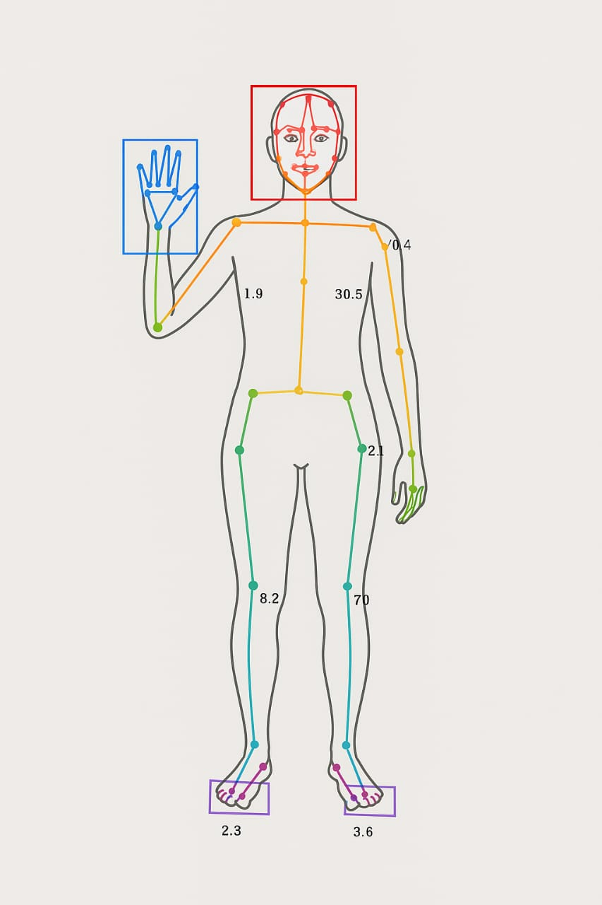

# AI-Based-Movement-Tracker-for-Comatose-Patients
Research of SIH project on AI-Based Movement Tracker  for Comatose Patients

# Goal : 
Patients in comatose states are difficult to monitor continuously. Traditional methods require manual observation, which may miss subtle recovery signs. Our project aims to develop an AI-based system that automatically detects and records even minute movements in comatose patients to assist healthcare professionals.

# Objectives
1.Detect micro-movements (finger, toe, eyelid, wrist).
2.Use AI pose estimation (OpenPose) to track patient skeleton keypoints.
3.Store detected movements in CSV logs for medical analysis.
4.Provide alerts to doctors/nurses when movement is detected.
5.Enable continuous monitoring with low computational load using edge devices (NVIDIA Jetson Nano GPU).

## Tech Stack
**Programming Languages:**  
- Python – for AI model integration, data processing, and scripting  
- C++ – for performance-critical operations and OpenPose integration
   
**Libraries / Frameworks:**  
- [OpenPose](https://github.com/CMU-Perceptual-Computing-Lab/openpose) – real-time human pose estimation  
- CUDA – GPU acceleration for deep learning computations  
- cuDNN – optimized GPU primitives for neural networks
  
**Tools / Development Environment:**  
- CMake – for building OpenPose and managing dependencies  
- Visual Studio 2022 – IDE for C++ and Python integration  
- Git – version control
- Git Bash
  
**Hardware (Proposed / Recommended):**  
- NVIDIA Jetson Nano or similar GPU-enabled edge device – for real-time processing and low-latency inference
 
**Output / Data Storage:**  
- CSV files – to log detected movements and generate records for analysis

# How OpenPose Helps
OpenPose plays a central role in our AI-based movement tracker by providing **real-time pose estimation**. It detects keypoints on the human body, including joints, fingers, toes, and facial points, which allows our system to :

1 . Identify subtle movements : Even small changes in a patient’s body position, like finger twitches or eyelid movements, can be captured.  
2 . Provide a visual reference : Skeleton overlays help verify movement detection and ensure accuracy.  
3 . Enable automated analysis : By translating body movements into keypoint data, the system can log movements in CSV files without manual observation.  
4 . Work efficiently with GPUs : When combined with CUDA and cuDNN, OpenPose processes video frames quickly, making continuous monitoring possible on edge devices like NVIDIA Jetson Nano.  

In short, OpenPose allows us to **track micro-movements precisely and efficiently**, forming the foundation of our AI-based monitoring system.

# Demo Video: Keypoint Detection
This demo video shows how OpenPose detects keypoints on the human body in real-time. Each dot represents a joint or body part, and the lines connecting them form a skeleton overlay. This visualization helps explain how keypoints are placed to detect movement.

      
# Keypoints Illustration
Below is an example image showing how keypoints are mapped on the body using OpenPose. Each point corresponds to a joint, which enables the AI to track even subtle movements accurately.

## Acknowledgments & Research Scope
We extend our sincere gratitude to the external resources and contributors that have been foundational to this project:
* **Core Technology:** Special thanks to the CMU Perceptual Computing Lab for their work on [OpenPose](https://github.com/CMU-Perceptual-Computing-Lab/openpose), which is the cornerstone of our real-time pose estimation solution.
* **Institutional Support:** Gratitude to Sri Vasavi Engineering College , Peddatadepalli and our project mentor(s) for their valuable guidance and resources throughout this initial phase.

**Scope of Research:**
Up to this point, all research and analysis have been focused on understanding the requirements, evaluating relevant technologies, and identifying the core components necessary for an AI-based movement tracker for comatose patient system. The resources cited above represent the foundational elements that will guide any future development efforts.

